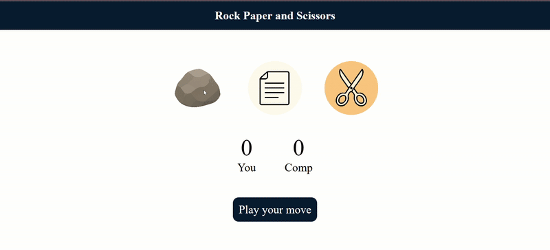
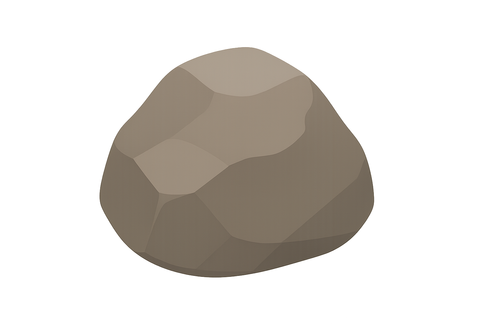
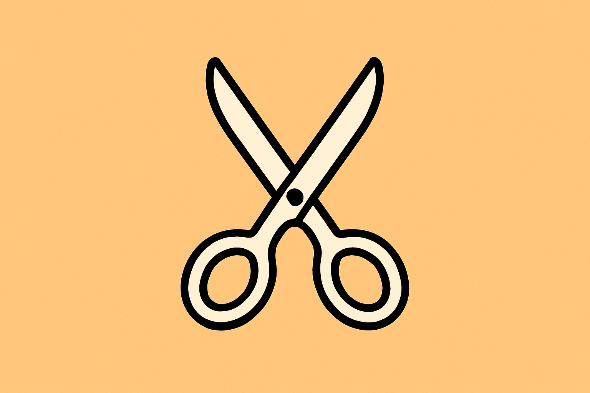

# 🎮 Rock Paper Scissors Game  

A fun, interactive **Rock Paper Scissors** game built with **HTML**, **CSS**, and **JavaScript**.  
Play against the computer, track your score, and enjoy a clean UI with unique rock, paper, and scissors icons.

---

## 🚀 Live Demo  
🔗 **[Play Now on GitHub Pages](https://mandvibhadouriya.github.io/rock-paper-scissors)**

---

## 🎥 Gameplay Preview  

---

## 📸 Screenshots  
| Rock | Paper | Scissors |
|------|-------|----------|
|  |  |  |

---

## 🛠 Tech Stack  
- **HTML5** – Structure  
- **CSS3** – Styling
- **JavaScript** – Game logic  

---

## ✨ Features  
- 🎯 **Play against computer** with randomized moves  
- 📊 **Score tracking** for player and computer  
- 🎨 **Unique custom icons** for rock, paper, and scissors  
- 📱 **Responsive design** for mobile & desktop  
- 🔄 **Instant feedback** on each round  

